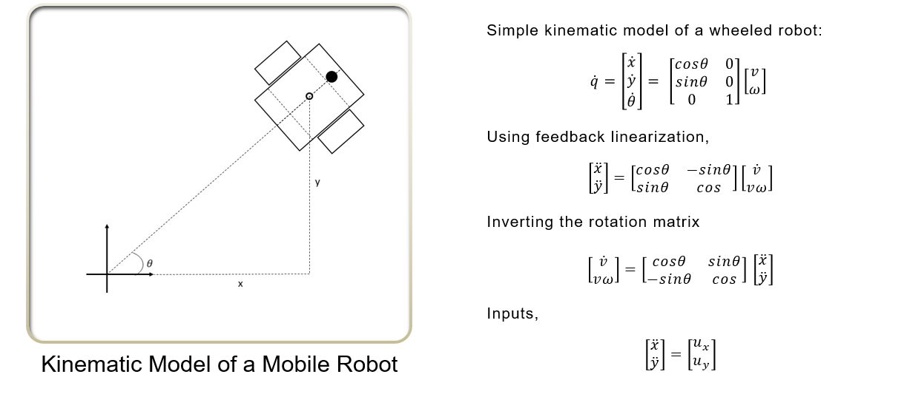
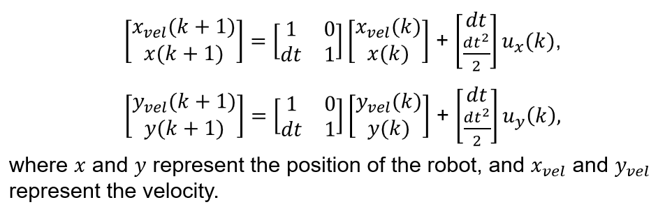
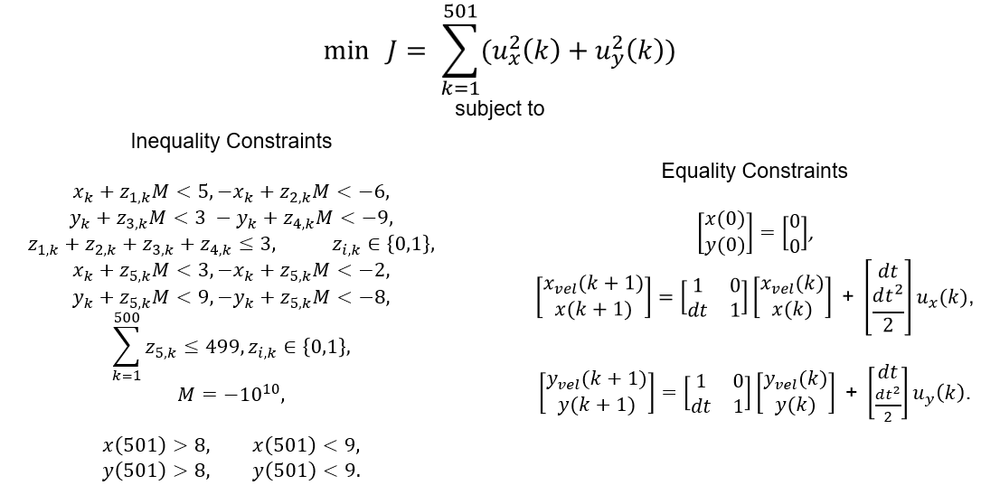
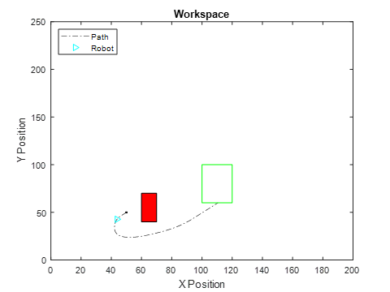

# Finegrained Path Planner

## Status

The first cut at the planning problem involved using an optimization tool and a constraint solver separately to generate feasible paths for the robots based on Newton's laws of motion.

This approach was quickly abandoned due to its computational inefficiency coupled with the fact that it did not solve the scheduling/assignment problem we were focused on at this level of the project. The method is documented here largely for completeness.

# Approach
We formulated a mixed integer linear program (MILP) to minimize the total energy used over time to go from a start position to a goal position. The objective function was derived from Newton's laws of motion as below.

## Energy Derivation
We start with a simple kinematic model of a mobile robot in the plane. We then use linearization on the positional variables *x* and *y* to derive the relationship between the robot's acceleration in the world frame with its acceleration and rotational velocity in its local frame. Finally, we invert the rotation matrix and choose the *x-y* acceleration as our inputs to the system. The sum of these inputs over the entire plan horizon is what we choose as our objective function.

## Discretization
The equality constraints are generated using a discretized version of the laws of motion, which effectively specify the robot's next state given its current position, velocity, input accelerations, and the sample time *dt*. The discretization is shown below.

## MILP Definition
With the robot's feasible movements, energy relationships, and the obstacle locations defined, we can then formulate the full MILP as shown in the figure below.

## Solution
The figures below show the results of the Gurobi optimization and the Z3 constraint solution. We see that Gurobi, being an optimizer, was able to generate an optimal path, whereas Z3 simply provided a feasible solution.

  |  
:-------------------------:|:-------------------------:
Gurobi Solution             |  Z3 Solution