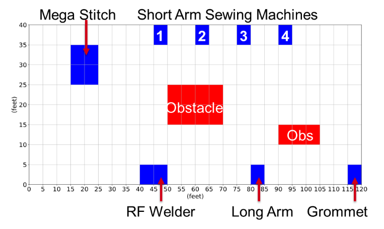
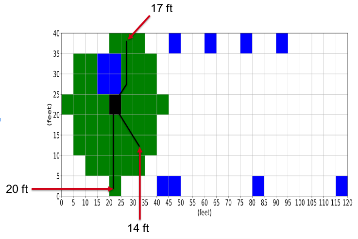

# Metric Task and Path Planner

## Status

The metric planner was designed to account for robot's physical capabalities in a mapped environment when planning paths and scheduling tasks. We chose to discretize the world, both in time and space, to reduce the dimensionality of the problem from the fine-grained planning problem.

We also switched our focus to one of efficiently scheduling tasks and assigning those tasks to available robots.

The metric representation of the workspace took into account the robot’s speed and size, as well as the chosen space and time discretization to define the set of reachable locations from any point in the map. The figure below shows a cherry-picked workspace in this metric representation, and the next figure shows the reachable set from the robot for a 10-second timestep, 5-ft space step, and 2 ft/s robot speed.

The major issue we found with this representation of the workspace was that construction of the reachability constraint provided a major bottleneck in the process. For 4-6 robots in the workspace above and a 60 timestep horizon, the average reachable constraint setup took ~200 seconds. We also found that setting up the constraints for sequencing two- and three-station visits was taking a prohibitively long time. For the planner to be consistently useful, it needs to be very fast for re-planning scenarios. To this end, we chose to also abandon the metric representation at this level. 
