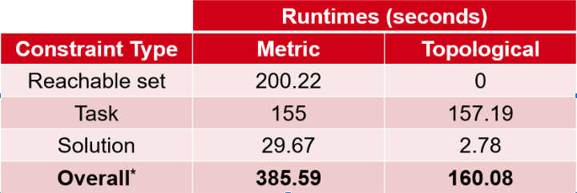
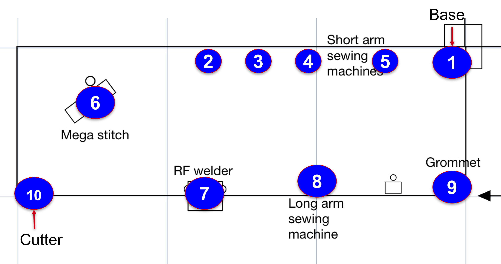

# Topological Scheduler

## Status

This version of the scheduler was designed based on a topological representation of the workspace. After changing from the metric to topological, we were able to speed up the constraint construction process significantly. The following table compares the runtimes between the metric and topological representations for a complex 6-robot planning scenario. The speedup is on the order of 60% from metric to topo. For more practical scenarios, the runtimes for the topo representation were on the order of 20-40 seconds, further underscoring the method’s potential. However, we chose to also scrap this method for reasons described in the following section.

