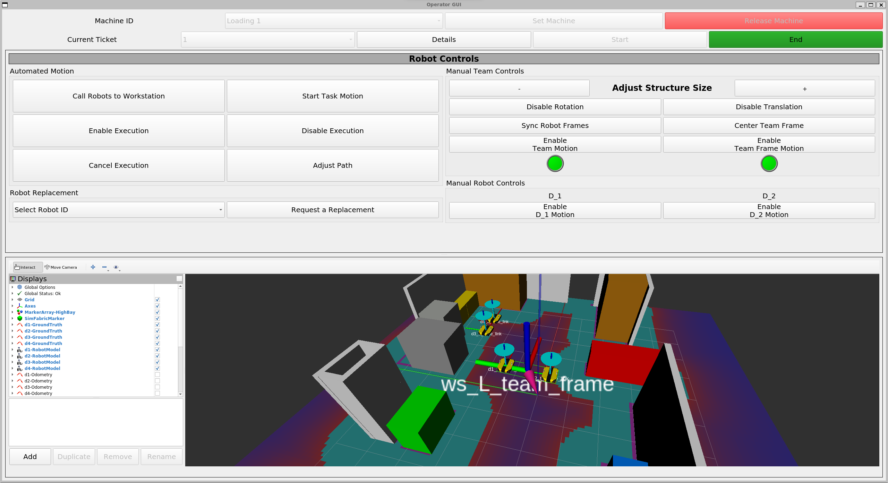

# Workspace

This folder contains the high-level components in a readily-usable form. The README holds instructions for installing, building, and using the high-level portion of the project.


## Status


## Installation
The following instructions assume you're running an Ubuntu 20.04 system with ROS Noetic Desktop-Full. If that is not the case, these instructions may not work exactly as intended.
1. [Ubuntu Install Instructions](https://ubuntu.com/tutorials/install-ubuntu-desktop#1-overview)
2. [ROS Noetic Install Instructions](https://wiki.ros.org/noetic/Installation/Ubuntu)

### Repositories
Clone this repository into a new folder.
```bash
cd
mkdir multiRobotPlanner
cd multiRobotPlanner
git clone https://github.com/Chukwuemeka-Ike/multiRobotPlanner.git . 
```

Clone the following repositories by Burak into the *src/* subfolder for running the simulations.
```bash
cd workspace/src
git clone https://github.com/burakaksoy/RVizMeshVisualizer.git
git clone https://github.com/burakaksoy/AssistiveRobot-SimulationFiles.git
git clone https://github.com/burakaksoy/uwb_gazebo_plugin.git
git clone https://github.com/burakaksoy/Swarm-Robotics-2.git
```

### Project Dependencies
#### System-Level Packages
First, we start by installing the system-level package dependencies. The list of packages required to run this project are listed in *[apt_requirements.txt](apt_requirements.txt)*. The *[install_apt_packages](install_apt_packages.bash)* bash script installs all the packages in that file.

```bash
cd workspace
chmod +x install_apt_packages.bash # make the script executable
sudo ./install_apt_packages.bash
```

The user interfaces in this project contain RViz windows that show a simulated representation of what is happening on the factory floor. To do so, we rely on the work done by [Burak Aksoy](https://github.com/burakaksoy). His work brings additional package dependencies to this project, which can be installed using the commands below:
```bash
chmod +x install_burak_dependencies.bash
sudo ./install_burak_dependencies.bash
```

#### Python Packages
Next, we install the Python dependencies.
```bash
pip3 install -r py_requirements.txt
```

### Build
Navigate to *workspace*, build the packages, and source the built workspace packages with the following commands.
```bash
cd workspace
catkin_make -DCATKIN_BLACKLIST_PACKAGES='dingo_base;dingo_customization'
source devel/setup.bash
```
If this runs correctly, the project's components should be ready to use.

## Usage
### High-Level System
The high-level planning system is made up of the following components.
1. Ticket Manager (TM)
2. Task Scheduler (TS)
3. Machine Manager (MM)
4. Robot Assigner (RA)

To use the high level system, we need components 1-4 running to support the overall operation. Open a terminal window and launch those components using:
```bash
roslaunch arm_utils high_level.launch
```

With these running, the system can now accept tickets into the TM, schedule those tickets (TS), assign the tickets to machines, and assign available robots to the jobs (RA).

For testing, the *add_tickets* script adds a set of tickets, which triggers the TM to request a schedule from the TS and to update the tickets when the schedule is generated. Use the script by running:
```bash
rosrun ticket_manager add_tickets.py
```


### User Interface
There are two graphical user interfaces (GUIs) for working with the system.
1. Supervisor GUI (SG) - ticket management and overall system monitoring
2. Operator GUI (OG) - ticket operation and ticket-specific robot control

With the high level background components running, we can now run the GUI's.
```bash
roslaunch arm_gui both_guis.launch
```
To have the underlying simulations show up in both UI's RViz windows, open another terminal and run the following commands.
```bash
cd multiRobotPlanner/workspace
chmod +x robot_sim.bash
./robot_sim.bash
```
With the high-level components, the user interfaces, and the robot simulations running, and with tickets added, the GUIs should look similar to the images below.

|||
|-|-|
|<center>Supervisor GUI</center>|<center>Operator GUI</center>|

The SG can be used to add and edit tickets in the high-level system, and to delete entire jobs from the system. It also allows the user monitor the overall workspace and schedule progression.

The OG can be used to work on tickets, which involves starting the tickets, controlling the robots assigned to the tickets, and ending those tickets. Starting and ending tickets steps through the schedule until there are no tickets left.


## High-Level Descriptions
In this section, we describe different implementation pieces of the high-level system - ROS messages, services, nodes, etc.

### Machines
Each machine in the workspace is given a unique identifier by the Machine Manager. The scheduler assigns tickets to machines using their ID's, and instances of the Operator GUI are bound to specific machine IDs to determine which tickets they can work on.

### Messages
---
#### IntList
List of integers. Used in [MachinesOverview.srv](src/arm_msgs/srv/MachinesOverview.srv) for a list of lists of integers.

#### RobotEnableStatus
When an **Operator GUI** is working on a ticket with assigned robots, the operator can disable or enable individual robots based on their needs. This message is sent whenever the robot enable statuses change, so swarm_control.py can update which robots in that team are enabled/disabled.

The message definition is shown below.
```
int32[] enabled_ids
uint32[] disabled_ids
```
#### Ticket
A Ticket is the atomic component of the high-level system. It represents a task that needs to be completed towards building a piece. Jobs can be built using multiple tickets. 

The message definition is shown below.
```
Header header
uint32 job_id
uint32 ticket_id
uint32[] parents
float32 duration
uint32 machine_type
uint32 num_robots
string status
uint32 start
uint32 end
uint32 machine_id 
float32 time_left
```
Each Ticket starts with basic information about the task that is needed for scheduling:
1. ticket ID - unique identifier for the ticket
2. parents - the set of tickets that must be completed before the ticket can start
3. duration - estimate of how long the ticket should take
4. machine_type - the type of machine needed for the task
5. num_robots - number of robots requested for the task

When the scheduler generates a schedule, it adds information for the task's start and end times, and assigns the task a machine_id.

When a ticket is ongoing, its time_left field is updated every few seconds by the Ticket Manager. As the ticket goes from waiting to ready to ongoing to done, the Ticket manager updates its status.

#### TicketMotionParams
This is the message sent from the Operator GUI to the Swarm Path Executer whenever the operator wants to start a ticket's pre-planned team motion with the enabled robots.

The machine and needle locations are collected from the Machine Manager when the OG is bound to that machine.
```
string path_csv_filename    # name of the file containing the ticket's path.
float32[] machine_location  # [x, y, theta] location of the machine.
float32[] needle_location   # [x, y, theta] location of the machine's needle.
```
#### Tickets
List of Ticket messages.

### Services
---
#### FleetInformation
The FleetInformation service from the **Robot Assigner** provides information about the robot fleet that does not change during runtime. This information includes the number of robots in the fleet, the names of each robot, names of their real and virtual TF frames, and multiple ROS topic names.

Service users:
1. Operator GUI
2. Modified [swarm_control.py](https://github.com/Chukwuemeka-Ike/Swarm-Robotics-2/blob/dev/src/swarm_control/src/swarm_control.py)

The service definition is shown below.
```
# No request data
---
uint32 fleet_size                       #
string[] robot_names                    #
string[] robot_command_topics           # used by OG to command the physical robots
string[] robot_frame_command_topics     # used by OG to command the virtual robot frames
string[] real_robot_frame_names         #
string[] virtual_robot_frame_names      #
string[] robot_desired_state_topics     # used by swarm_control.py to send robot desired poses
string tf_changer_topic                 # used by OG to update specific TF frames
string robot_enable_status_topic        # used by OG to enable and disable robots while on tasks
```
#### MachinesOverview
The MachinesOverview service from the **Machine Manager** provides information about all available machines at startup.

Service users:
1. Supervisor GUI - used for the schedule visualization and for ticket management dialogs
2. Task Scheduler - used to know which machines can be assigned tasks

The service definition is shown below.
```
# No request data
---
uint32[] machine_ids            # all unique machine IDs.
IntList[] grouped_machine_ids   # machine IDs grouped by machine type.
uint32[] machine_type_indices   # indices of each machine type.
string[] machine_type_names     # names of each machine type.
string[] machine_type_abvs      # abbreviations of each machine type name.
```
#### MachineStatus
The MachineStatus service from the **Machine Manager** provides information about a specific machine.

Service users:
1. Operator GUI - used to know which tickets are assigned to the machine it is currently bound to.

The service definition is shown below.
```
uint32 machine_id           # ID of the machine we want info about.
---
string status               # status of the machine.
uint32[] assigned_ids       # tickets assigned to the machine.
uint32[] ready_assigned_ids # ready tickets assigned to the machine.
float32[] machine_location  # pose near the machine for calling robots.
float32[] needle_location  # machine's needle pose for automated task motion.
```
#### RobotAssignments
The RobotAssignments service from the **Robot Assigner** provides robot assignment information for a specific ticket. Primarily allows an operator GUI populate the robot control buttons.

Service users:
1. Operator GUI - used to know which robots the operator has control over during a task
2. Modified [swarm_control.py](https://github.com/Chukwuemeka-Ike/Swarm-Robotics-2/blob/dev/src/swarm_control/src/swarm_control.py)

The service definition is shown below.
```
uint32 ticket_id                    # ticket whose assignments we want.
---
uint32 num_assigned_robots          # number of robots assigned to the ticket.
uint32[] assigned_robot_ids         # IDs of the robots assigned to the ticket.
```
#### RobotReplacement
The RobotReplacement service from the **Robot Assigner** allows the **Operator GUI** request a replacement for a specific robot while they are working on a ticket.

The service definition is shown below.
```
int32 robot_id                  # robot that needs replacement.
---
int32 replacement_id            # ID of the replacement if successful.
bool replacement_successful     #
```
#### Schedule
The Schedule service from the **Task Scheduler** allows the **Ticket Manager** request a schedule whenever its ticket list changes or an ongoing ticket runs over time.

The service definition is shown below.
```
Ticket[] tickets    # all unfinished tickets.
Ticket[] ongoing    # set of ongoing tickets.
---
Ticket[] tickets    # tickets updated with the newest schedule.
```
#### TicketList
The TicketList service from the **Ticket Manager** provides all tickets that are currently in the system.

Service users:
1. Machine Manager - monitors changes to the ticket list to keep track of tickets assigned to machines
2. Operator GUI - looks at the information about a ticket currently being worked on
3. Robot Assigner - monitors changes to the ticket list to keep track of tickets' robot requirements. Maintains robot assignments as long as jobs are ongoing and removes them when jobs are deleted/completed. Edits those assignments if the number of robots needed changes.
4. Supervisor GUI - shows the job list and allows the supervisor edit tickets as long as they're not done.

The service definition is shown below.
```
# No request data.
---
Ticket[] all_tickets    # set of all tickets.
uint32[] waiting        # IDs of waiting tickets.
uint32[] ready          # IDs of ready tickets.
uint32[] ongoing        # IDs of ongoing tickets.
uint32[] done           # IDs of done tickets.
```
#### UnboundMachines
The UnboundMachines service from the **Machine Manager** provides the list of machines that are not yet bound to an **Operator GUI**. This info is useful when an operator wants to set the GUI to the machine they're working at.

The service definition is shown below.
```
# No request data.
---
uint32[] machine_ids    # IDs of machines not bound to any Operator GUI.
string[] machine_names  # names of the machines.
```
